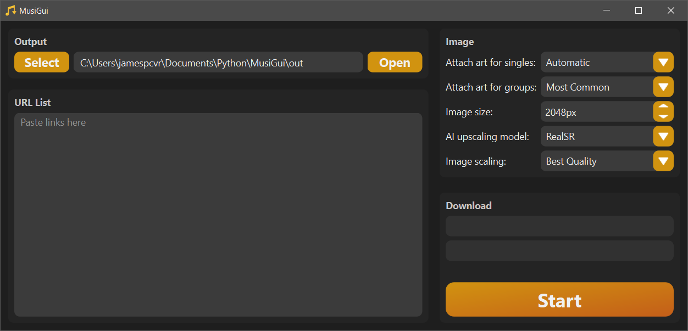

# What is MusiGui?

Pronounced `myou-zi-goo-ee`, it is a GUI wrapper around [yt-dlp](https://github.com/yt-dlp/yt-dlp) and optionally provides automated access to AI upscalers, including [RealSR](https://github.com/nihui/realsr-ncnn-vulkan) and [Waifu2x](https://github.com/nihui/waifu2x-ncnn-vulkan).



<details>
<summary>Light and Midnight themes</summary>


</details>

# Setup

The easiest way to get up and running is to run the [prebuilt executable](https://github.com/JamesPCVR/MusiGui/releases/latest). Alternatively, you can run this program from source, or build it yourself.

`yt-dlp` requires ffmpeg, follow [this guide](https://phoenixnap.com/kb/ffmpeg-windows) to install it if you haven't already.

I would also reccommend downloading [mp3tag](https://www.mp3tag.de/en/download.html) it is really handy for editing and managing a library of `.mp3` files.

## Running prebuilt executable

Download the [latest release](https://github.com/JamesPCVR/MusiGui/releases/latest), unzip the contents, and run `MusiGui.exe`

## Running from source

### Dependencies
`json`, `typing`, `os`, `sys`, `subprocess`,`logging`, `time`, `shutil`, `re`, `ctypes`, `webbrowser` are included in the [python standard library](https://docs.python.org/3/library/index.html).

You can easily install `yt_dlp`, `numpy`, `eyed3`, `cv2`, `showinfm`, `pyperclip`, `concurrent_log_handler` using [pip](https://pip.pypa.io/en/stable/).

```bash
py -m pip install yt-dlp
py -m pip install numpy
py -m pip install opencv-python
py -m pip install PySide6
py -m pip install eyed3
py -m pip install showinfm
py -m pip install pyperclip
py -m pip install concurrent_log_handler
```
The prefix `py -m` is only required for windows systems.

Then you just need to run `main.py`.

### First use

- Pick a download folder, this is the working directory for this application, it should be seperate from anything else.
- Download any (or all) of the [supported models](#supported-ai-models) and place it in the directory `ai` folder. Its subfolder should be named `<model>-ncnn-vulkan`.

### Typical use
- Add URLs to the text box in the bottom left, they are seperated with a newline (\<enter>). The URLs can be for any media and only the audio is downloaded. The URLs can be from any site [supported by yt-dlp](https://github.com/yt-dlp/yt-dlp/blob/master/supportedsites.md).
- Once you've added all the URLs you want, hit the download button in the bottom right to download the files one-by-one. The program will also download the cover art for each item.
- Cover are will be scaled to fit the selected size unless an AI model is selected, where if the image is too small, it will be upscaled first and then shrunk down.

### Hidden settings

If you want to restore default settings, delete the `config` folder. Musigui will recreate it with defaults.

Select the theme by modifying `assets\themes.json`, change the value of `"selected": "light"` to one of `"light"`, `"dark"` or `"midnight"`. MusiGui will fall back to light mode if it cannot find the selected theme, failing that it uses the system native theme.

Change the AI upscaler directory by modifying `config\image.json`, it is created on first run. Update the value of `"ai_directory"` using double backslashes `"\\"` instead of single slashes.

# Supported AI models

Be sure to download at least one of these and put it in the `ai` folder.

| Model Download | License |
| --- | --- |
| [realsr-ncnn-vulkan](https://github.com/nihui/realsr-ncnn-vulkan) | [MIT](https://choosealicense.com/licenses/mit/) |
| [waifu2x-ncnn-vulkan](https://github.com/nihui/waifu2x-ncnn-vulkan) | [MIT](https://choosealicense.com/licenses/mit/) |
| [srmd-ncnn-vulkan](https://github.com/nihui/srmd-ncnn-vulkan) | [MIT](https://choosealicense.com/licenses/mit/) |

# Credits

[supported models](#supported-ai-models) - nihui and many others

# License

[MIT](https://choosealicense.com/licenses/mit/)